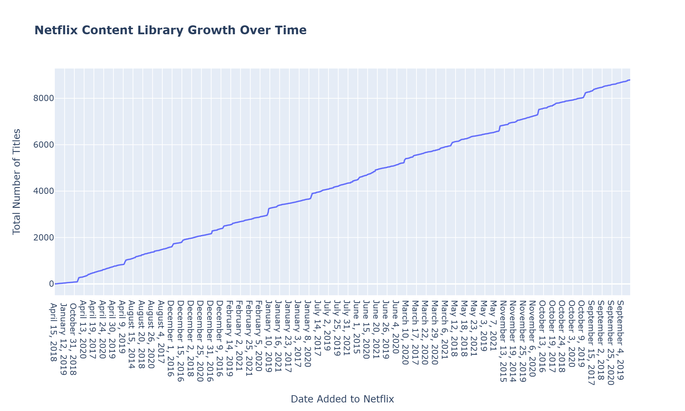
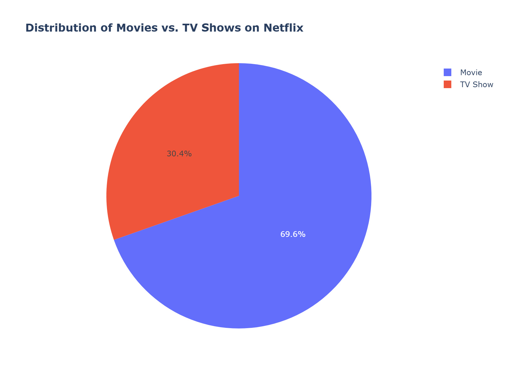
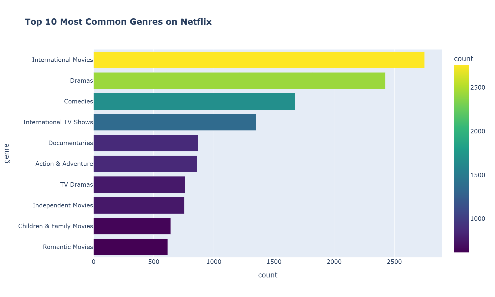

# 🎬 Netflix Content Analysis

A comprehensive data analysis project exploring trends and patterns in Netflix's movie and TV show library.

## 📊 Overview

This project analyzes Netflix's content catalog to answer questions about:
- The growth of Netflix's library over time
- The balance between Movies and TV Shows
- Global content production trends
- Genre and rating popularity

## 🔧 Tech Stack

- **Python:** Pandas, NumPy
- **Visualization:** Plotly, Matplotlib, Seaborn
- **Data:** [Netflix Movies and TV Shows dataset from Kaggle](https://www.kaggle.com/datasets/shivamb/netflix-shows)

## 📈 Key Insights

### 1. Netflix Originals Boom
The number of titles on Netflix has seen explosive growth since around 2015, coinciding with the company's major push into original content production.

### 2. Movies Rule the Catalog
Despite the popularity of bingeable series, Movies still make up the majority of Netflix's library.

### 3. International Focus
Dramas, Comedies, and International content are the most dominant genres on the platform, highlighting Netflix's global strategy.

### 4. 🚀 Content-Based Recommendation Engine
**Going beyond basic analysis, I built a machine learning system that recommends similar movies/shows based on plot and genre similarity.** Using NLP techniques like TF-IDF and cosine similarity, the engine can suggest content similar to any title in the dataset.

**Example Recommendation:**
- **Input:** "Stranger Things"
- **Output:** Horror/Mystery shows with similar themes and descriptions
- **Technology:** Scikit-learn, TF-IDF Vectorization, Cosine Similarity

## 🚀 How to Run

1. Clone the repo
2. Install dependencies: `pip install -r requirements.txt`
3. Run the Jupyter Notebook: `jupyter notebook Netflix_Analysis.ipynb`
